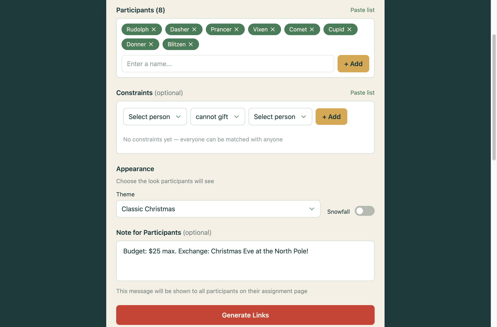

# Secret Santa

A web application for organizing Secret Santa gift exchanges. Create participant lists, set assignment constraints, and generate unique reveal links for each person.

| Organizer View | Participant View |
|----------------|------------------|
|  |  |

## Features

- **Participant Management** — Add participants individually or paste a bulk list
- **Constraints** — Define who can't gift whom, or force specific matches
- **Deterministic Assignments** — Seeded randomization ensures reproducible results
- **Shareable Links** — Each participant gets a unique URL to reveal their assignment
- **Themes** — Choose from Classic Christmas, Winter Blue, Elegant Gold, or Berry Frost
- **Snowfall Animation** — Optional animated snow effect
- **Organizer Notes** — Include budget, date, or other details for all participants
- **State Persistence** — Save your entire setup as a URL to edit later

## How to Use

### For Organizers

1. Add participants by typing names or pasting a list
2. (Optional) Add constraints:
   - `Alice !-> Bob` — Alice cannot be assigned to Bob
   - `Alice -> Bob` — Alice must be assigned to Bob
3. (Optional) Add notes (budget, date, location)
4. (Optional) Choose a theme and enable snowfall
5. Click **Generate Links**
6. Share each participant's unique link
7. Save the state URL to make changes later

### For Participants

1. Open your unique link
2. See who you're gifting along with any organizer notes

---

## Development

### Prerequisites

- Node.js (v18+)

### Installation

```bash
npm install
```

### Running Locally

```bash
npm run dev
```

Opens a local dev server with hot reload.

### Production Build

```bash
npm run build
npm run preview   # Preview the build locally
```

### Tech Stack

- TypeScript
- Vite
- Tailwind CSS
- GSAP (animations)

### Project Structure

```
src/
├── main.ts              # Router and UI orchestration
├── organizer.ts         # Assignment logic and link generation
├── participant.ts       # Assignment reveal view
├── state.ts             # Setup serialization
├── themes.ts            # Theme definitions
├── snowfall.ts          # Snow animation
├── crypto/
│   ├── encryption.ts    # URL encoding/decoding
│   ├── seededRandom.ts  # Deterministic RNG
│   └── shuffle.ts       # Fisher-Yates shuffle
└── components/
    ├── ParticipantInput.ts
    └── ConstraintBuilder.ts
```

## License

MIT
